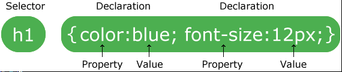

# 语法

CSS规则由两个主要的部分构成：选择器，以及一条或多条声明：



说明：

- 选择器通常是需要改变样式的HTML元素。
- 每条声明由一个属性和一个值组成。
- 属性(property)是你希望设置的样式属性(style attribute)。每个属性有一个值。属性和值由冒号分开。

例1：下面这行代码的作用是将 h1 元素内的文字颜色定义为红色，同时将字体大小设置为 14 像素。

在这个例子中， h1 是选择器，color和 font-size 是属性，red和 14px 是值。

```css
h1 {color:red; font-size:14px;}
```

下面的示意图为您展示了上面这段代码的结构：


> 提示：用花括号来包围声明。


## 注释

注释语法：

```css
/*
comment
*/
```
