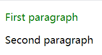
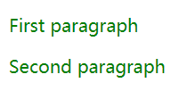
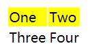

# DOM Selection

|Method|Description|
|---|---|
|`d3.select(css-selector)`|返回匹配css-selector的第一个HTML元素|
|`d3.selectAll(css-selector)`|返回所有匹配css-selector的HTML元素|

## select

### Select Element By Name

例如：

[选择段落](../sample_code/d3_demos/select_by_name.html)

效果：

说明：

- `d3.select("p")` 返回第一个 `
` 元素。
- `style("color", "green")` 设置 `color` 属性为 `green`。

### Select Elelemnt by Id

例如：

[根据id选择段落](../sample_code/d3_demos/select_by_id.html)

效果

## selectAll

根据 CSS 选择器选择所有匹配的HTML元素。

### Select All Elements by Name

例如：

[设置所有段落颜色为绿色](../sample_code/d3_demos/selectAll_by_name.html)

效果：

### Select All Elements by CSS Class Name

例如：

[设置 `class=myclass`的所有段落](../sample_code/d3_demos/selectAll_by_classs_name.html)

## Select Nested Elements

`select()` 和 `selectAll()` 方法都可用于选择嵌套元素。例如：

[将表格第一行每个单元格的背景设置为黄色](../sample_code/d3_demos/select_nested.html)

效果

`d3.select("tr")` 选择了表格的第一行，然后 `selectAll("td")` 选择该行的所有 `<td>` 元素。
