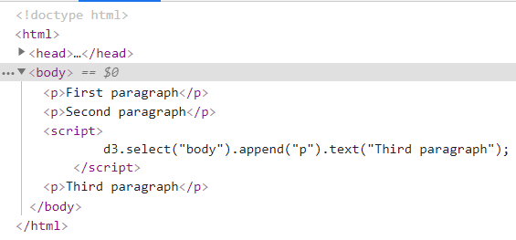
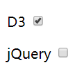

# DOM Manipulation using D3

使用 D3 修改 DOM 元素。在用 `d3.select()` 或 `d3.selectAll()` 选择元素后，可以用如下方法修饰 DOM。

|Method|Description|
|---|---|
|`text("content")`|获取或设置元素的文本|
|`append("element name")`|在选择的元素中添加一个新元素（作为选择元素的子元素添加到最后）|
|`insert("element name")`|插入元素|
|`remove()`|移除元素|
|`html("content")`|设置选择元素内部的HTML|
|`attr("name", "value")`|设置属性|
|`property("name", "value")`|设置属性|
|`style("name", "value")`|设置样式|
|`classed("css class", bool)`|获取、添加或移除 css class|

## Method Chaining

d3 的方法调用可以串联起来，使得代码更为简洁：

```js
d3.select("body").append("p").text("Hello World!");
```

第一个方法的输出是第二个方法的输出。

如果分开写是这样子的：

```js
var bodyElement = d3.select("body");

var paragraph = bodyElement.append("p");

paragraph.text("Hello World!");
```

## text()

`d3.selection.text()` 方法添加或修改选择元素的文本内容。

例如：[设置段落的文本](../sample_code/d3_demos/text.html)

在该例子中，`select("p")` 选择第一个段落，然后使用 `.text("This is paragraph.")` 设置文本。

## append()

`d3.selection.append()` 方法创建一个新的元素，并添加到选择元素的后面。

例如：[添加一个段落](../sample_code/d3_demos/append.html)

`d3.select("body")` 返回 `<body>` 元素，然后使用 `.append("p")` 创建一个 `<p>` 元素并添加到 `<body>` 的末尾。运行后的效果：



## insert()

`insert(type[, before])`

如果 `type` 是 string，则插入该类型（tag name）的新元素到第一个匹配 `before` 选择器选择的元素前面。如果未指定 `before`，默认为 null。

## remove()

`d3.selection.remove()` 选择删除的DOM元素。

例如，[删除段落](../sample_code/d3_demos/remove.html)

效果：


第一个段落被删除，只有第二个段落显示。

## html()

`d3.selection.html()` 方法设置选择元素的内部 html。

例如：[选择段落，将其内容替换](../sample_code/d3_demos/select_html.html)

## attr()

`d3.selection.attr()` 方法设置选择DOM元素的属性。

例如：[通过设置段落的 class，从而应用 style](../sample_code/d3_demos/select_attr.html)

结果：


将段落的 `class` 设置为 `error` 后，`<head>` 中的 `<style>` 将应用到了该段落。

## property()

部分元素使用 `attr()` 方法无法设置其属性，如 checkbox 的 checkedProperty，此时可以使用 `property()` 方法。

例如：[勾选上 `checkbox`](../sample_code/d3_demos/select_property.html)

效果：



## style()

`d3.selection.style()` 方法应用指定样式到选择的元素。

如：

```html
<p>Error: This is dummy error.</p>
<script>
    d3.select("p").style("color", "red")
</script>
```

## classed()

`d3.selection.classed()` 方法设置 `class` 属性或修改 `classList` 属性。

例如：

```html
<style>
    .error {
        color: red
    }
</style>
<body>
    <p>This is error.</p>

    <script>
        d3.select("p").classed('error', true);
    </script>
</body>
```

在上例中，`classed("myClass", true)` 将 `error` class 添加到选择的 `<p>` 元素。第二个 `boolean` 属性如果为 `true`，表示添加 class，如果未 `false`，表示移除。
