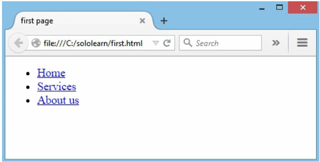

# HTML 5

## Introduction

HTML5 文件开头为：

```html
<!DOCTYPE HTML>
```

字符编码：

```html
<meta charset="UTF-8">
```

新元素：

`<article>`, `<aside>`, `<audio>`, `<canvas>`, `<datalist>`, `<details>`, `<embed>`, `<footer>`, `<header>`, `<nav>`, `<output>`, `<progress>`, `<section>`, `<video>`等等。

关于 Forms:

- HTML5 中的 Form 2.0 版本功能更强大
- 添加了 Date Pickers, color pickers, numeric stepper 等。
- 输入字段类型添加了 email, search 和 URL。
- 支持 `PUT` 和 `DELETE` 表单方法。

集成 API

- Drag and Drop
- Audio and Video
- Offline Web Applications
- History
- Local Storage
- Geolocation
- Web Messaging

## Content Models

HTML5 引入了 7 种内容模型：

- Metadata
- Embedded
- Interactive
- Heading
- Phrasing
- Flow
- Sectioning

有些元素属于多种内容模型。


### Metadata

Content that sets up the presentation or behavior of the rest of the content. These elements are found in the `head` of the document.

`<base>`, `<link>`, `<meta>`, `<noscript>`, `<script>`, `<style>`, `<title>`

### Embedded

Content that imports other resources into the document.

`<audio>`, `<video>`, `<canvas>`, `<iframe>`, ``, `<math>`, `<object>`, `<svg>`

### Interactive

Content specifically intended for user interaction.

`<a>`, `<audio>`, `<video>`, `<button>`, `<details>`, `<embed>`, `<iframe>`, ``, `<input>`, `<label>`, `<object>`, `<select>`, `<textarea>`

### Heading

Defines a section header.

`<h1>`, `<h2>`, `<h3>`, `<h4>`, `<h5>`, `<h6>`, `<hgroup>`

### Phrasing

This model has a number of inline level elements in common with HTML4.

``, `<span>`, `<strong>`, `<label>`, `<br />`, `<small>`, `<sub>`, and more.

### Flow

Contains the majority of HTML5 elements that would be included in the normal flow of the document.

### Sectioning

Defines the scope of headings, content, nagigation, and footers.

`<article>`, `<aside>`, `<nav>`, `<section>`

## HTML5 Page Structure

HTML5 页面结构如下：


### header

在 HTML 4 中可以如此定义 header:

```html
<div id="header">
```

而在 HTML5中，可以直接使用 `<header>` 标签定义。

`<header>` 一般在 `<body>` 中定义：

```html
<!DOCTYPE html>
<html>
   <head></head>
   <body>
      <header>
        <h1> Most important heading </h1>
        <h3> Less important heading </h3>
      </header>
   </body>
</html>
```

结果：


要注意 `<header>` 和 `<head>` 完全不同。

### footer

定义页面底部的内容。下面的信息一般在 `<footer>` 中提供：

- Contact Information
- Privacy Policy
- Social Media Icons
- Terms of Service
- Copyright Information
- Sitemap and Related Documents

### nav

该标签用于定义页面的导航部分，包含指向其它页面会当前页面其它部分的链接。例如：

```html
<nav>
   <ul>
      <li><a href="#">Home</a></li>
      <li><a href="#">Services</a></li>
      <li><a href="#">About us</a></li>
   </ul>
</nav>
```

结果



## article

`<article>` 用于取代 HTML4 中的 `<div>` 元素，定义独立自包含的内容。

潜在应用：

- 论坛帖子
- 报纸文章
- 博客条目
- 用户评论

## section

定义文档中的节。

例如：

```html
<section>
  <h1>PRC</h1>
  <p>The People's Republic of China was born in 1949...</p>
</section>
```

## aside

定义页面之外的内容。例如文章的侧栏。

`<aside>` 在 `<article>` 标签之外使用。

## audio

`<audio>` 用于定义音频内容。

例如：

```html
<audio src="someaudio.wav">
您的浏览器不支持 audio 标签。
</audio>
```

在开始标签和结束标签之间放置文本内容，这样老的浏览器就可以显示不支持该标签内容。

可以通过 `<source>` 指定多个音频来源：

```html
<audio controls>
   <source src="audio.mp3" type="audio/mpeg">
   <source src="audio.ogg" type="audio/ogg">
</audio>
```

浏览器会使用第一个识别出来的格式。

### 属性

- controls

指定音频控件是否显示。

- autoplay

是否自动播放音频。

- loop

是否循环播放。
