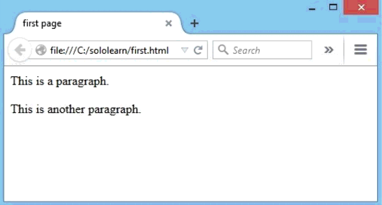
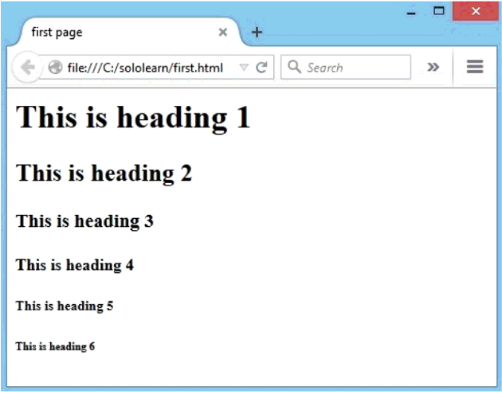
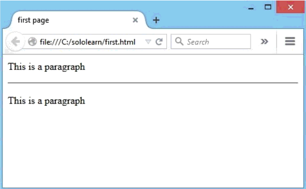

# Element

- [Element](#element)
  - [p](#p)
    - [align](#align)
  - [br](#br)
  - [格式化元素](#%e6%a0%bc%e5%bc%8f%e5%8c%96%e5%85%83%e7%b4%a0)
    - [strong](#strong)
    - [标题](#%e6%a0%87%e9%a2%98)
  - [hr](#hr)
    - [属性](#%e5%b1%9e%e6%80%a7)
      - [width](#width)
  - [注释](#%e6%b3%a8%e9%87%8a)
  - [input](#input)
  - [type](#type)
  - [placeholder](#placeholder)
- [script](#script)
- [已废弃元素](#%e5%b7%b2%e5%ba%9f%e5%bc%83%e5%85%83%e7%b4%a0)
  - [`<center>`](#center)

## p

使用 `<p>` 创建段落。浏览器会自动在段落后添加空行。

例如：

```html
<html>
   <head>
      <title>first page</title>
   </head>
   <body>
      <p>This is a paragraph. </p>
      <p>This is another paragraph. </p>
   </body>
</html>
```

效果：



### align

`align` 属性用于指定对其方式。在 HTML 5 中 `<p>` 不支持 align 属性。

## br

`<br/>` 可用于换行。

`<br/>` 是空的 HTML 元素形式，没有结束标签。

## 格式化元素

### strong

`<strong>` 用于加粗文本。

### 标题

HTML 包含六级标题，包括 `<h1>`, `<h2>`, `<h3>`, `<h4>`, `<h5>` 和 `<h6>`。

例如：

```html
<html>
   <head>
      <title>first page</title>
   </head>
   <body>
      <h1>This is heading 1</h1>
      <h2>This is heading 2</h2>
      <h3>This is heading 3</h3>
      <h4>This is heading 4</h4>
      <h5>This is heading 5</h5>
      <h6>This is heading 6</h6>
   </body>
</html>
```

效果：



> 标题不应当用于放大文本，因为检索引擎或使用标题索引网页结构和内容。

## hr

`<hr>` 用于在页面插入横线。例如：

```html
<html>
   <head>
      <title>first page</title>
   </head>
   <body>
      <h1>This is heading 1</h1>
      <h2>This is heading 2</h2>
      <h3>This is heading 3</h3>
      <h4>This is heading 4</h4>
      <h5>This is heading 5</h5>
      <h6>This is heading 6</h6>
      <p>This is a paragraph </p>
      <hr />
      <p>This is a paragraph </p>
   </body>
</html>
```

结果：


### 属性

#### width

指定宽度。

如：

```html
<hr width="50px" />
```

也可以用比例值：

```
<hr width="50%" />
```

## 注释

格式：

```html
<!-- Your comment goes here -->
```

例：

```html
<html>
   <head>
      <title>first page</title>
   </head>
   <body>
      <p>This is a paragraph </p>
      <hr />
      <p>This is a paragraph </p>
      <!-- This is a comment -->
   </body>
</html>
```

结果：



可以看到，注释并没有在网页中显示。

## input

HTML `<input>` 元素用于基于 Web 的表单创建交互式控件，以便接受来自用户的数据；可以使用各种类型的输入数据和控件小部件，具体取决于设备和 user agent.

例如：

```html
<label for="name">Name (4 to 8 characters):</label>

<input type="text" id="name" name="name" required
       minlength="4" maxlength="8" size="10">
```

## type
`<input>` 元素的 `text` 类型创建基础的单行文本框。

## placeholder
提示用户输入框的作用。用于提示的占位符文本不能包含回车或换行。仅适用于当 `type` 属性为 `text`, `search`, `tel`, `url` 或 `email` 时，否则被忽略。

> Note: 请不要用placeholder 属性替换 `<label>` 元素。他们的作用不同:  `<label>` 属性描述表单元素的角色; 也就是说，它展示预期的信息，而 `placeholder` 属性是提示用户内容的输入格式。某些情况下 `placeholder` 属性对用户不可见, 所以当没有它时也需要保证form能被理解。


# script
`<script>` 元素用于定义客户端脚本。
- `<script>` 元素要么包含脚本内容，要么通过 `src` 属性指定外部脚本文件。
- JavaScript 常用于图像处理、表单验证和动态更改内容。
- JavaScript 常通过 `document.getElementById()` 方法获得 HTML 元素。

例如：
```html
<script>
document.getElementById("demo").innerHTML = "Hello JavaScript!";
</script
```

# 已废弃元素

## `<center>`
HTML Center 元素