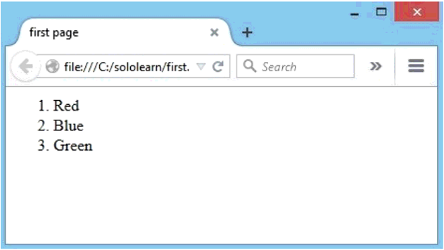
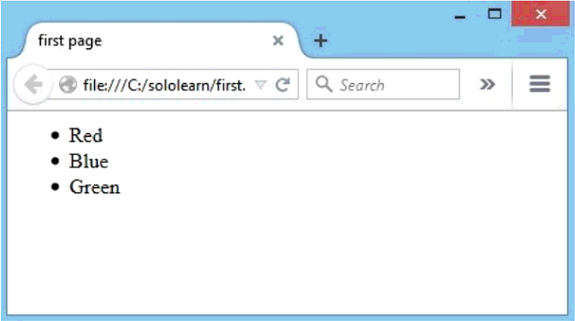

# List

## 简介

排序列表使用 `<ol>` 标签，每个列表项用 `<li>` 标签来定义。例如：

```html
<html>
   <head>
      <title>first page</title>
   </head>
   <body>
      <ol>
        <li>Red</li>
        <li>Blue</li>
        <li>Green</li>
      </ol>  
   </body>
</html>
```

结果：



`<ul>` 用于定义无序列表。如：

```html
<html>
   <head>
      <title>first page</title>
   </head>
   <body>
      <ul>
        <li>Red</li>
        <li>Blue</li>
        <li>Green</li>
      </ul>  
   </body>
</html>
```

结果：


