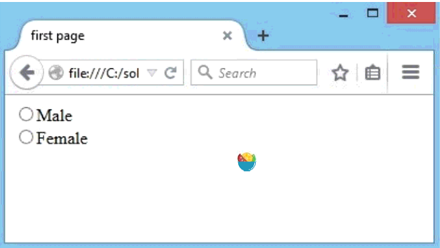
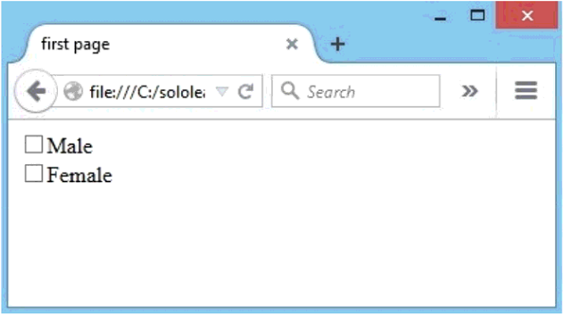
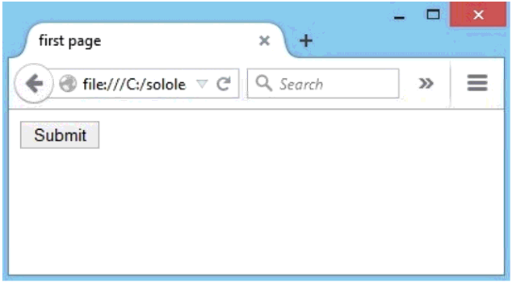
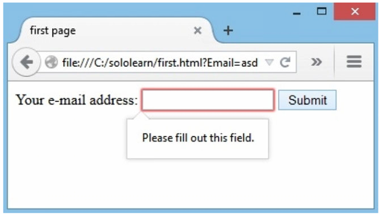

# Form

- [Form](#form)
  - [Intro](#intro)
  - [属性](#%e5%b1%9e%e6%80%a7)
    - [action](#action)
    - [method](#method)
  - [input](#input)
    - [Input Types](#input-types)
    - [Text](#text)
    - [Password](#password)
    - [Button](#button)
    - [Radio](#radio)
    - [checkbox](#checkbox)
    - [submit](#submit)
  - [HTML5 Forms](#html5-forms)
    - [placeholder](#placeholder)
    - [autofocus](#autofocus)
    - [required](#required)
    - [search](#search)
    - [datalist](#datalist)

## Intro

HTML `<form>` 元素用于收集用户输入信息的表单。格式如下：

```html
<form>
.
form elements
.
</form>
```

HTML 表单包含一系列的表单元素。

表单数据一般提交到网页服务器上的一个网页。

## 属性

### action

`action` 属性指定用户提交数据后打开的网页。

```html
<form action="http://www.sololearn.com"> 
</form>
```

### method

`method` 属性用于指定提交表单时使用的HTTP方法（`GET` or `POST`）。

```html
<form action="url" method="GET">
```

对 `GET` 方法，表单数据在网址中可见。

```html
<form action="url" method="POST">
```

`POST` 用于更新数据，或者包含敏感数据（如密码）。`POST`的安全性更高，因为其提交的属性在网页不可见。

## input

`<input>` 元素是表单最重要的元素。

`<input>` 元素可以以多种方式显示，取决于 `type` 属性。

### Input Types

HTML input 的不同类型：

```html
<input type="button">
<input type="checkbox">
<input type="color">
<input type="date">
<input type="datetime-local">
<input type="email">
<input type="file">
<input type="hidden">
<input type="image">
<input type="month">
<input type="number">
<input type="password">
<input type="radio">
<input type="range">
<input type="reset">
<input type="search">
<input type="submit">
<input type="tel">
<input type="text">
<input type="time">
<input type="url">
<input type="week">
```

### Text

`<input type="text">` 定义单行文本输入字段：

```html
<form>
  First name:<br>
  <input type="text" name="firstname"><br>
  Last name:<br>
  <input type="text" name="lastname">
</form>
```

其效果如下：


### Password

`<input type="password">` 定义密码字段。

例：

```html
<form>
  User name:<br>
  <input type="text" name="username"><br>
  User password:<br>
  <input type="password" name="psw">
</form>
```

效果：


密码字段中的字符被屏蔽，以星号或圆圈显示。

### Button

`<input type="button">` 定义按钮。
例：

```html
<input type="button" onclick="alert('Hello World!')" value="Click Me!">
```

效果：


### Radio

`radio` 类型让用户在多个选择中选一个：

```html
<input type="radio" name="gender" value="male" /> Male <br />
<input type="radio" name="gender" value="female" /> Female <br />
```

结果：



### checkbox

`checkbox` 类型可以选择多个：

```html
<input type="checkbox" name="gender" value="1" /> Male <br />
<input type="checkbox" name="gender" value="2" /> Female <br />
```



### submit

`submit` 用于提交数据：

```html
<input type="submit" value="Submit" />
```



数据提交后，应当在服务器端用编程语言处理数据，如PHP。

## HTML5 Forms

HTML5 中 form 的创建和 HTML4 相同：

```html
<form>
   <label>Your name:</label>
   <input id="user" name="username" type="text" />
</form>
```

### placeholder

在 `<input>` 和 `<textarea>` 元素中，`placeholder` 属性用于添加提示信息：

```html
<form>
   <label for="email">Your e-mail address: </label>
   <input type="text" name="email" placeholder="email@example.com" />
</form>
```

效果


### autofocus

使得希望输入的地方获得聚焦：

```html
<form>
   <label for="email">Your e-mail address: </label> 
   <input type="text" name="email" autofocus/>
</form>
```

效果


### required

要求输入元素时必须的

```html
<form autocomplete="off">
   <label for="e-mail">Your e-mail address: </label>
   <input name="Email" type="text" required />
   <input type="submit" value="Submit"/>
</form>
```

如果字段没有填写，提交不成功：



`autocomplete` 属性指定表单输入字段是否自动完成。

如果自动完成打开，浏览器会基于用户之前输入的值自动完成。

HTML5 添加的新类型

- color
- date
- datetime
- datetime-local
- email
- month
- number
- range
- search
- tel
- time
- url
- week

HTML5 添加的新属性

- autofocus
- form
- formaction
- formenctype
- formmethod
- formnovalidate
- formtarget
- height and width
- list
- min and max
- multiple
- pattern (regexp)
- placeholder
- required
- step

### search

用于创建搜索框。

```html
<input id="mysearch" name="searchitem" type="search" />
```

### datalist

定义候选值：

```html
<input id="car" type="text" list="colors" />
<datalist id="colors">
   <option value="Red">
   <option value="Green">
   <option value="Yellow">
</datalist>
```


`<datalist>` 的 `id` 必须和 `<input>` 中的 `list` 的属性值匹配。
