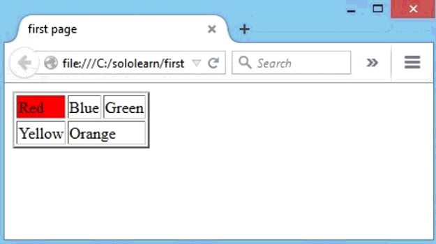

# Table

## 简介

使用 `<table>` 标签创建表格。

- 使用 `<tr>` 定义行。
- 使用 `<td>` 定义列（table data）。
- `<th>` 用于定义标题。

例如：

```html
<table>
   <tr>
      <td></td>
      <td></td>
      <td></td>
   </tr>
</table>
```

`<td>` 类似数据容器，其中可以包含所有类型的HTML元素，包括文本，图片，列表等等。

## border & colspan

可以使用 `border` 属性定义表格边框：

```html
<table border="2">
```

一个表格单元可以跨越多列：

```html
<table border="2">
   <tr>
      <td>Red</td>
      <td>Blue</td>
      <td>Green</td>
   </tr>
   <tr>
      <td><br /></td>
      <td colspan="2"><br /></td>
   </tr>
</table>
```

结果：


HTML 5 不支持 `border` 属性。

## align & bgcolor

`align` 用于定义对齐方式，如：

```html
<table align="center">
```

通过 `bgcolor` 属性指定背景颜色。如：

```html
<table border="2">
   <tr>
      <td bgcolor="red">Red</td>
      <td>Blue</td>
      <td>Green</td>
   </tr>
   <tr>
      <td>Yellow</td>
      <td colspan="2">Orange</td>
   </tr>
</table>
```

结果：



> 在设置元素样式方面，CSS比HTML更有效。

