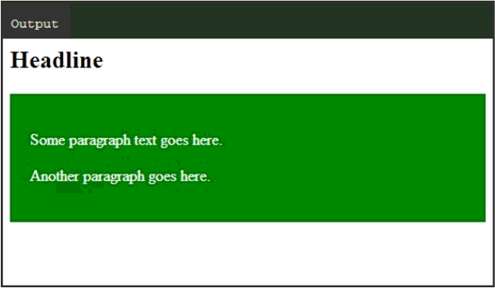

# 分类

## 简介

在 HTML 中，大部分元素定义为 **block level** 或 **inline**。

- block level 元素以新一行开始。如 `<h1>`, `<form>`, `<li>`, `<ol>`, `<ul>`, `<p>`, `<pre>`, `<table>`, `div` 等。
- inline 元素一般单行显示。如 `<b>`, `<a>`, `<strong>`, ``, `<input>`, `em`, `<span>`等。

block 元素可以包含多个 inline 元素，而 inline 元素不能包含 block 元素。

有部分元素既可以作为 nline 元素，也可以作为 block 元素。包括：

- APPLET, 内嵌的 Java applet
- IFRAME, inline frame
- INS, inserted text
- MAP, image map
- OBJECT, embedded object
- SCRIPT, script within an HTML document.

## div

`<div>` 一般用于其它 HTML 元素的容器。和CSS结合起来，可以方便的对一块内容设置样式：

```html
<html>
  <body>
    <h1>Headline</h1>
    <div style="background-color:green; color:white; padding:20px;">
      <p>Some paragraph text goes here.</p>
      <p>Another paragraph goes here.</p>
    </div>
  </body>
</html>
```

结果：



## span

而在 inline 元素中 `<span>` 一般用于部分文本的容器，这样可以方便地对部分文本设置样式：

```html
<html>
  <body>
    <h2>Some 
      <span style="color:red">Important</span>
    Message</h2>
  </body>
</html>
```

结果：


