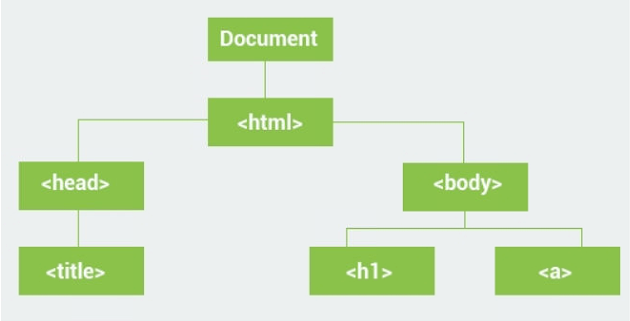

# Document Object Model

## 简介

在web浏览器载入网页时，根据网页内容构建 DOM object。



JavaScript 可用于网页的DOM对象，动态的添加、删除和修改元素。

## DOM object

`innerHTML` 属性几乎可以用于所有 HTML 元素以修改其内容。

## 属性

Element 的属性：

- element.childNodes returns an array of an element's child nodes.
- element.firstChild returns the first child node of an element.
- element.lastChild returns the last child node of an element.
- element.hasChildNodes returns true if an element has any child nodes, otherwise false.
- element.nextSibling returns the next node at the same tree level.
- element.previousSibling returns the previous node at the same tree level.
- element.parentNode returns the parent node of an element.

例如，修改所有段落内容为 “new text”：

```html
<html>
  <body>
    <div id ="demo">
      <p>some text</p>
      <p>some other text</p>
    </div>

    <script>
     var a = document.getElementById("demo");
     var arr = a.childNodes;
     for(var x=0;x<arr.length;x++) {
       arr[x].innerHTML = "new text";
     }
    </script>

  </body>
</html>
```

## 方法

### Selecting Elements

```js
//finds element by id
document.getElementById(id)

//finds elements by class name
document.getElementsByClassName(name)

//finds elements by tag name
document.getElementsByTagName(name)
```

例如，选择 `id="demo"` 的元素，并修改其内容：

```js
var elem = document.getElementById("demo");
elem.innerHTML = "Hello World!";
```

选择所有 `class="demo"` 的元素，返回数组：

```js
var arr =  document.getElementsByClassName("demo");
//accessing the second element
arr[1].innerHTML = "Hi";
```

根据 tag name 选择，下面选择所有段落并修改内容

```html
<p>hi</p>
<p>hello</p>
<p>hi</p>
<script>
var arr = document.getElementsByTagName("p");
for (var x = 0; x < arr.length; x++) {
  arr[x].innerHTML = "Hi there";
}
</script>
```

### 修改元素

#### 修改属性

理论上来说，HTML元素的所有属性都可以修改。

如，修改 `` 的 `src` 属性：

```html

<script>
    var el = document.getElementById("myimg");
    el.src = "apple.png";
</script>
```

修饰链接的 `href` 属性：

```html
<a href="http://www.example.com">Some link</a>
<script>
    var el = document.getElementsByTagName("a");
    el[0].href = "http://www.sololearn.com";
</script>
```

#### 修改 Style

所有 style 相关的属性都可以使用 `style` object元素。例如：

```html
<div id="demo" style="width:200px">some text</div>
<script>
  var x = document.getElementById("demo");
  x.style.color = "6600FF";
  x.style.width = "100px";
</script>
```

修改了文本的颜色和div的宽度。

需要注意，属性名称不要用断线 "-"，全部换成骆驼形式，如 `background-color` 属性变成 `backgroundColor`。

### 添加和删除元素

#### 创建元素

使用下面的方法创建新的节点：

- `element.cloneNode()` clones an element and returns the resulting node.
- `document.createElement(element)` creates a new element node.
- `document.createTextNode(text)` creates a new text node.

例如：

```js
var node = document.createTextNode("Some new text");
```

改方法创建了一个新的文本节点，不过此时该文本不会显示，必须添加到已有的元素上：

- `element.appendChild(newNode)` adds a new child node to an element as the last child node.
- `element.insertBefore(node1, node2)` inserts node1 as a child before node2.

实例：

```html
<div id ="demo">some content</div>

<script>
  //creating a new paragraph
  var p = document.createElement("p");
  var node = document.createTextNode("Some new text");
  //adding the text to the paragraph
  p.appendChild(node);

  var div = document.getElementById("demo");
  //adding the paragraph to the div
  div.appendChild(p);
</script>
```

创建了一个新的段落，并添加到页面已有的 `div` 元素。

#### 删除元素

要删除 HTML 元素，首选选择其父元素，然后用 `removeChild(node)`。例如：

```html
<div id="demo">
  <p id="p1">This is a paragraph.</p>
  <p id="p2">This is another paragraph.</p>
</div>

<script>
    var parent = document.getElementById("demo");
    var child = document.getElementById("p1");
    parent.removeChild(child);
</script>
```

移除 `id="p1"` 的段落。

还有种方法：

```js
var child = document.getElementById("p1");
child.parentNode.removeChild(child);
```

两种方法本质是一样的。

#### 替换元素

使用 `element.replaceChild(newNode, oldNode)` 实现。例如：

```html
<div id="demo">
  <p id="p1">This is a paragraph.</p>
  <p id="p2">This is another paragraph.</p>
</div>

<script>
    var p = document.createElement("p");
    var node = document.createTextNode("This is new");
    p.appendChild(node);

    var parent = document.getElementById("demo");
    var child = document.getElementById("p1");
    parent.replaceChild(p, child);
</script>
```

创建了一个新的段落替换原来的 `p1` 段落。

## Creating Animations

下面创建一个包含 `box` 元素的简单 HTML 页面：

```html
<style>
#container {
  width: 200px;
  height: 200px;
  background: green;
  position: relative;
}
#box {
  width: 50px;
  height: 50px;
  background: red;
  position: absolute;
}
</style>
<div id="container">
   <div id="box"> </div>
</div>
```

`box` 元素放在 `container` 元素中。可以发现，`box` 的位置是 `absolute`，而 `container` 的位置是 `relative`。

要创建动画，需要在小的时间区间内修改元素属性。通过 `setInterval()` 方法实现。例如：

```js
var t = setInterval(move, 500);
```

该方法每 500 毫秒调用一次 `move` 方法，用于改变 box 的位置。

```js
// starting position
var pos = 0;
//our box element
var box = document.getElementById("box");

function move() {
  pos += 1;
  box.style.left = pos+"px"; //px = pixels
}
```

为了防止一直往右移动，通过 `clearInterval()` 停止 timer:

```js
function move() {
  if(pos >= 150) {
    clearInterval(t);
  }
  else {
    pos += 1;
    box.style.left = pos+"px";
  }
}
```

当 `left` 属性到 150，刚好到右端，此时停止 timer。最终代码：

```js
var pos = 0;
//our box element
var box = document.getElementById("box");
var t = setInterval(move, 10);

function move() {
  if(pos >= 150) {
    clearInterval(t);
  }
  else {
    pos += 1;
    box.style.left = pos+"px";
  }
}
```

## 事件处理

当事件发生，`handler` 函数执行。常见的HTML事件：


事件可以通过属性添加到 HTML 元素：

```html
 <p onclick="someFunc()">some text</p>
```

事件处理器也可以通过 JavaScript 分配：

```js
var x = document.getElementById("demo");
x.onclick = function () {
  document.body.innerHTML = Date();
}
```

例如，下面定义一个按钮，当用户点击按钮，显示一个弹窗：

```html
<button onclick="show()">Click Me</button>
<script>
function show() {
  alert("Hi there");
}
</script>
```

### 事件

`onload` 和 `onunload` 事件在用户进入和离开页面时激活。所以适合于在页面载入后执行操作：

```html
<body onload="doSomething()">
```

类似的，`window.onload` 事件可用于在整个页面载入后执行代码：

```js
window.onload = function() {
   //some code
}
```

`onchange` 一般用于文本框。当文本框内的文本改变并且焦点丢失，对应事件处理器被调用。例如：

```html
<input type="text" id="name" onchange="change()">
<script>
    function change() {
        var x = document.getElementById("name");
        x.value= x.value.toUpperCase();
    }
</script>
```

## 事件监听器

`addEventListener()` 添加事件处理器到元素，不覆盖原有的事件处理器。

```js
element.addEventListener(event, function, useCapture);
```

参数说明：

- `event` 是事件类型，如 "click" 或 "mousedown"。这里不添加 "on"，即不用 "onclick"。
- `function` 是触发事件时希望调用的函数。
- `useCapture` 是 boolean 值，表示是 bubbling 或 capturing，可选参数。

例如：

```js
element.addEventListener("click", myFunction);
element.addEventListener("mouseover", myFunction);

function myFunction() {
  alert("Hello World!");
}
```

添加后可移除：

```js
element.removeEventListener("mouseover", myFunction);
```

下面创建一个时间处理器，在执行后移除：

```html
<button id="demo">Start</button>

<script>
    var btn = document.getElementById("demo");
    btn.addEventListener("click", myFunction);

    function myFunction() {
        alert(Math.random());
        btn.removeEventListener("click", myFunction);
    }
</script>
```

点击按钮后，显示一个随机数，然后监听器被移除。

## 事件传播

在 HTML DOM 中事件传播有两种方式：bubbling 和 capturing。

- Capturing goes down the DOM.
- Bubbling goes up the DOM.

事件传播定义事件发生时元素的顺序。假如 `<div>` 元素中有一个 `<p>` 元素，用户点击 `<p>` 元素，则哪个元素先收到该事件？

在 bubbling中，最里面的元素先处理事件，然后向外传递。所以先处理 `<p>` 的点击事件，然后是 `<div>` 的点击事件。

在 capturing 中，则相反。

在 `addEventListener()` 方法中允许通过 `useCapture` 指定事件传播方式：

```js
addEventListener(event, function, useCapture)
```

默认为 `false`，即采用 bubbling方式。

```js
//Capturing propagation
elem1.addEventListener("click", myFunction, true); 

//Bubbling propagation
elem2.addEventListener("click", myFunction, false);
```

## 创建 Image Slider

下面创建一个 image slider 项目，通过 "Next" 和 "Prev" 按钮切换图片。

先创建一个 HTML，包含图片和两个按钮：

```html
<div>
  <button> Prev </button>
  
  <button> Next </button>
</div>
```

然后定义实例图片数组：

```js
var images = [
   "http://www.sololearn.com/uploads/slider/1.jpg", 
   "http://www.sololearn.com/uploads/slider/2.jpg", 
   "http://www.sololearn.com/uploads/slider/3.jpg"
];
```

然后定义 Next 和 Prev 按钮点击事件：

HTML

```HTML
<div>
  <button onclick="prev()"> Prev </button>
  
  <button onclick="next()"> Next </button>
</div>
```

JS

```js
var images = [
"http://www.sololearn.com/uploads/slider/1.jpg", 
"http://www.sololearn.com/uploads/slider/2.jpg", 
"http://www.sololearn.com/uploads/slider/3.jpg"
];
var num = 0;

function next() {
  var slider = document.getElementById("slider");
  num++;
  if(num >= images.length) {
    num = 0;
  }
  slider.src = images[num];
}

function prev() {
  var slider = document.getElementById("slider");
  num--;
  if(num < 0) {
    num = images.length-1;
  }
  slider.src = images[num];
}
```

其中 `num` 变量持有当前图片的索引。