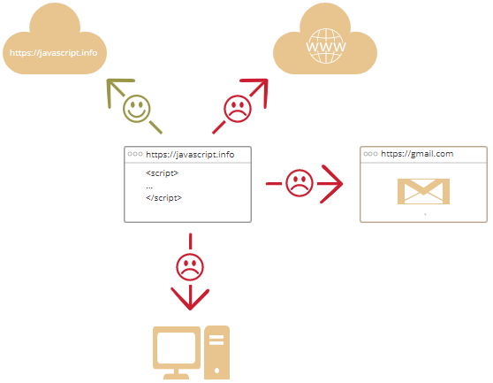

# 简介

- [简介](#%e7%ae%80%e4%bb%8b)
  - [概述](#%e6%a6%82%e8%bf%b0)
  - [JavaScript 环境](#javascript-%e7%8e%af%e5%a2%83)
  - [浏览器中的 JavaScript 功能](#%e6%b5%8f%e8%a7%88%e5%99%a8%e4%b8%ad%e7%9a%84-javascript-%e5%8a%9f%e8%83%bd)
    - [修改 HTML 内容](#%e4%bf%ae%e6%94%b9-html-%e5%86%85%e5%ae%b9)
    - [修改 HTML 属性](#%e4%bf%ae%e6%94%b9-html-%e5%b1%9e%e6%80%a7)
    - [改变HTML样式](#%e6%94%b9%e5%8f%98html%e6%a0%b7%e5%bc%8f)
    - [隐藏 HTML 元素](#%e9%9a%90%e8%97%8f-html-%e5%85%83%e7%b4%a0)
    - [显示 HTML 元素](#%e6%98%be%e7%a4%ba-html-%e5%85%83%e7%b4%a0)
  - [浏览器中 JavaScript 的限制](#%e6%b5%8f%e8%a7%88%e5%99%a8%e4%b8%ad-javascript-%e7%9a%84%e9%99%90%e5%88%b6)
  - [JavaScript 的特殊性](#javascript-%e7%9a%84%e7%89%b9%e6%ae%8a%e6%80%a7)
  - [JavaScript 扩展](#javascript-%e6%89%a9%e5%b1%95)
  - [总结](#%e6%80%bb%e7%bb%93)
  - [控制台](#%e6%8e%a7%e5%88%b6%e5%8f%b0)
    - [Google Chrome](#google-chrome)
  - [IDE](#ide)
    - [轻量级编辑器](#%e8%bd%bb%e9%87%8f%e7%ba%a7%e7%bc%96%e8%be%91%e5%99%a8)

## 概述

JavaScript 是为 HTML 和 Web 设计的编程语言。

Web 开发者必须会的三种语言有：

- HTML 定义网页内容
- CSS 定义网页布局
- JavaScript 定义网页行为

目前基于 JavaScript 语言已经开发了许多框架和数据库，最流行的是MEAN：

- M, MongoDB
- E, Express
- A, AngularJS
- N, Node.js

最初创建 _JavaScript_ 是为了让网页动起来。以该语言编写的程序称为脚本（_script_）。可以直接在网页HTML中编写脚本，在载入页面时自动运行。

脚本程序以纯文本的形式保存和运行，不需要预编译。所以JavaScript 和 Java 是两种完全不同的语言，不管是从概念还是设计上。

现在，JavaScript 不仅可以在浏览器上运行，还可以在服务器上运行，或者说，可以在任何配置有 JavaScript 引擎的设备上运行。

引擎工作的基本原理为：

1. 读取脚本
2. 将脚本转换为机器语言
3. 运行机器语言

浏览器内置的 JavaScript 引擎称为“JavaScript 虚拟机”（JavaScript virtual machine）。

不同的引擎具有不同的名称，例如：

| 引擎         | 支持浏览器      |
|:-------------|:---------------|
| V8           | Chrome, Opera  |
| SpiderMonkey | Firefox        |
| ChakraCore   | Microsoft Edge |
| Nitro        | Safari         |

引擎会对脚本的每个阶段进行优化，甚至可以在运行时监视编译的脚本，分析数据流并根据这些对机器码进行优化，从而提升脚本的执行速度。

## JavaScript 环境

在使用 JavaScript 前，首先需要一个 JavaScript 运行环境。

可以直接使用浏览器运行，对服务器端（如 Node.js），可以使用命令如 `node my.js` 运行脚本。

不过需要注意，应当尽可能少用浏览器端专有的命令（如 `alert`），以减少迁移到其它环境（如 Node.js）需要的时间。

> 装 `open in browser` 插件，可以在 Visual studio Code 打开浏览器，打开HTML文件，运行 JS 代码。

## 浏览器中的 JavaScript 功能

现代的 JavaScript 是一种“安全”的语言。它不提供对内存或 CPU 的底层访问，因为它最初是为浏览器设计的，不需要这些功能。

JavaScript 的能力依赖于它执行的环境。例如：Node.js 允许 JavaScript 读写任意文件、执行网络请求等。

浏览器中的 JavaScript 可以完成所有和网页相关的操作，处理用户和 Web 服务器之间的交互。

例如，浏览器中的 JavaScript 可以完成下面这些事：

- 在网页中插入 HTML 内容，修改现有网页的内容和样式。
- 响应用户的行为，响应鼠标的点击或移动、键盘的敲击。
- 向远程服务器发送请求，使用 AJAX 和 COMET 技术下载或上传文件。
- 获取或修改 cookie，向访问者提出问题、发送消息。
- 记住客户端的数据（本地存储）。

### 修改 HTML 内容

`getElementById()` 是 JavaScript 常用的一个方法，用于找到指定id的 HTML 元素。

下面先获得 `id="demo"` 的元素，然后修改其内容（`innerHTML`）为 "Hello JavaScript":

```js
document.getElementById("demo").innerHTML = "Hello JavaScript";
```

完整代码：

```html
<!DOCTYPE html>
<html>
<body>

<h2>JavaScript 能做什么</h2>

<p id="demo">JavaScript 能够改变 HTML 内容。</p>

<button type="button" onclick='document.getElementById("demo").innerHTML = "Hello JavaScript!"'>点击我！</button>

</body>
</html>
```

### 修改 HTML 属性

下面用 `` 的 `src` 属性改变HTML图像：

```html
<!DOCTYPE html>
<html>
<body>

<h2>JavaScript 能做什么？</h2>

<p>JavaScript 能够改变 HTML 属性值。</p>

<p>在本例中，JavaScript 改变了图像的 src 属性值。</p>

<button onclick="document.getElementById('myImage').src='/i/eg_bulbon.gif'">开灯</button>


<button onclick="document.getElementById('myImage').src='/i/eg_bulboff.gif'">关灯</button>

</body>
</html>
```

使用不同的灯泡图片，实现了开关灯的效果。

### 改变HTML样式

改变HTML样式，通过修改HTML属性实现：

```html
<p id="demo">JavaScript 能够改变 HTML 元素的样式。</p>

<button type="button" onclick="document.getElementById('demo').style.fontSize='35px'">
点击我！
</button>
```

点击按钮，修改字体大小。

### 隐藏 HTML 元素

通过修改 `display` 样式隐藏 HTML 元素：

```html
<p id="demo">JavaScript 能够隐藏 HTML 元素。</p>

<button type="button" onclick="document.getElementById('demo').style.display='none'">
点击我！
</button>
```

### 显示 HTML 元素

依然是通过 `display` 实现：

```html
<p id="demo" style="display:none">Hello JavaScript!</p>

<button type="button" onclick="document.getElementById('demo').style.display='block'">
点击我！
</button>
```

## 浏览器中 JavaScript 的限制

基于安全的考虑，浏览器中的 JavaScript 的功能限制较多，以防止恶意网站访问私人信息或损害用户数据。

这些限制包括但不限于：

- 不能对硬盘上的文件执行读写、复制或执行程序操作。不能直接访问OS功能。

现代浏览器允许 JavaScript 处理文件，但是访问受限，并且只有在用户执行某些操作（如将文件拖到浏览器窗口或通过 `<input>` 选择文件）时才能访问。

也有和相机/麦克风等设备交互的方法，不过这些操作都需要用户的许可。

- 不同的选项卡/窗口通常互不干涉。偶尔会出现一个窗口使用 JavaScript 打开另一个窗口， 即使是这种情况，如果另一个网页和当前网页不在同一个站点（如不同域名、协议或端口），JavaScript 也可能无法访问另一个页面。

该策略称为“相同来源策略”。要绕开该策略，两个页面都必须同意数据交互，并且有专门的 JavaScript 代码处理该问题。

- JavaScript 和当前页面所在的服务器交互很容易。但是它从其它站点接受数据的功能被削弱了。



如果在浏览器外使用 JavaScript（如服务器），这些限制都不存在。

## JavaScript 的特殊性

JavaScript 至少有三个独特特征：

- 和HTML/CSS 完美集成；
- 使用简单；
- 所有主流浏览器都支持。

JavaScript 是唯一包含这三个特征的浏览器技术。

## JavaScript 扩展

JavaScript 不可能适合所有人，因此现在出现了许多新的语言，这些语言代码在浏览器中运行前被转换为 JavaScript。

现代工具使得这些语言转换快速、透明，从而允许开发人员使用另一种语言进行编码，转换在后台自动完成。

例如：

- CoffeeScript 是 JavaScript 的语法糖。它引入了一些短的语法，从而让代码更为清晰简洁，Ruby 开发者喜欢它。
- TypeScript 添加了严格的数据类型，从而简化了复杂系统的开发及支持，由微软开发。
- Flow 也添加了数据类型，不过方式有所不同，由 Facebook 开发。
- Dart 是一个独立的语言，具有自己的引擎，可以在非浏览器环境（如移动端）运行，也可以转换为 JavaScript，由 Google 开发。

还有许多这类语言，不过即使我们使用其中一种编译语言，也应该先好好了解一下 JavaScript。

## 总结

- JavaScript 最初是为浏览器设计的语言，不过现在它也用在其它环境。
- JavaScript 由于和 HTML/CSS 的完美集成成为最广泛使用的浏览器语言。
- 有些 JavaScript 扩展语言，可以转换为 JavaScript 代码执行，建议在精通 JavaScript 有选择的学习。

## 控制台

浏览器中默认看不到错误，为了发现错误并获得一些与脚本相关且有用的信息，浏览器内置了 “开发者工具”。

通常，开发者倾向于使用 Chrome 或 Firefox 来开发，因为它们有最好的开发者工具。一些其他的浏览器也提供开发者工具，有时还具有一些特殊的功能，但通常是在模仿 Chrome 或 Firefox。所以大多数人都有 “最喜欢” 的浏览器，当遇到某个浏览器独有的问题的时候，人们就会切换到其他的浏览器。

开发者工具很强大，功能丰富。首先，我们要学习如何打开它们，查找错误和运行 JavaScript 命令。

### Google Chrome

打开网页 [bug.html](https://javascript.info/article/devtools/bug.html).

其中的 JavaScript 代码有个错误，直接打开看不到，可以通过 `F12` 打开开发者工具，大致如下：


开发者工具的具体视图取决于 Chrome 版本，不过其功能差不多：

- 可以看到红色错误信息，上图中，可以看到一个未知的 "lalala" 命令。
- 在右边有一个可点击的链接 `bug.html:12`，告诉了错误位置。

在错误信息下面有一个蓝色的 `>` 符号，用于标识命令行，在其中可以输入 JavaScript 命令，按 `Enter` 运行。

> 多行输入：按 `Shift+Enter` 可以实现多行输入。

## IDE

一个好的IDE可以让编程过程更为顺畅。

代码编辑器主要分为两种类型：IDE和轻量级编辑器。

IDE（Integrated Development Environment）指功能强大的编辑器，通常具有许多和项目相关的功能。顾名思义，它不仅仅是编辑器，而是一个完整的开发环境。

IDE 会加载整个项目，允许在不同文件之间切换，提供代码自动完成功能，并且和版本控制系统（如 git），测试环境以及其它项目级任务很好的集成。

用于 JavaScript 开发的常用IDE有：

- WebStorm （跨平台，付费）
- Netbeans
- Visual Studio Code （跨平台，免费）

### 轻量级编辑器

轻量级编辑器没有 IDE 强大，但是更快、更简单。它们主要用于快速打开和编辑文件。

轻量级编辑器和IDE之间的主要区别在于，IDE在项目级别上工作，因此会加载更多的数据，并在需要时分析项目的结构。如果你只需要编辑一个文件，毫无疑问轻量级编辑器更快。

实际上，轻量级编辑器也可以有很多插件，从而添加目录级别的语法分析器和自动完成功能，所以在IDE和轻量级编辑器之间，也没有严格的界限。

常见的轻量级编辑器：

- Atom （跨平台，免费）
- Visual Studio Code (跨平台，免费)
- Sublime Text (跨平台，共享软件)
- Notepad++ (Windows，免费)
- Vim, Emacs
