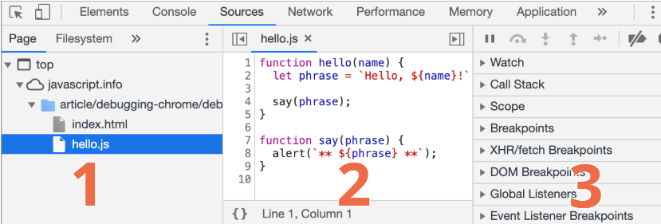
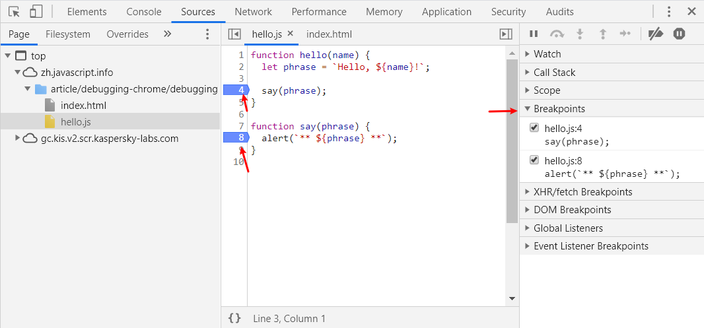

# Chrome 调试

- [Chrome 调试](#chrome-%e8%b0%83%e8%af%95)
  - [资源（Sources）面板](#%e8%b5%84%e6%ba%90sources%e9%9d%a2%e6%9d%bf)
  - [控制台（Console）](#%e6%8e%a7%e5%88%b6%e5%8f%b0console)
  - [断点（Breakpoints）](#%e6%96%ad%e7%82%b9breakpoints)
  - [debugger](#debugger)
  - [暂停后查看](#%e6%9a%82%e5%81%9c%e5%90%8e%e6%9f%a5%e7%9c%8b)
  - [跟踪执行](#%e8%b7%9f%e8%b8%aa%e6%89%a7%e8%a1%8c)

## 资源（Sources）面板

F12 打开 Chrome 开发者工具，转到 Sources 面板：

点击左上角的按钮可以打开文件列表。

Sources 面板包含三部分：

1. **文件浏览（File Navigator）** 区域列出了 HTML、JavaScript、CSS 和包括图片在内的其他依附于此页面的文件。Chrome 扩展程序也会显示在这。
2. **代码编辑（Code Editor）** 区域展示源码。
3. **JavaScript 调试（JavaScript Debugging）** 区域是用于调试的，我们很快就会来探索它。

## 控制台（Console）

在资源面板如果按下 `ESC`，下面会出现控制台，在控制台中可以输入 JavaScript 代码执行。如：

## 断点（Breakpoints）

选择网页的文件打开，在打开文件的行号上点击，即设置了断点。

在右侧的 "Brakpoints" 里可以看到设置的断点列表。

## debugger

## 暂停后查看

激活调试器的最简单方法是重新加载页面。

设置断点后，程序会在断点位置暂停：

右侧的信息列表可以查看当前代码的状态：

- 察看（Watch） —— 显示任意表达式的当前值。

可以点击加号 + 然后输入一个表达式。调试器将随时显示它的值，并在执行过程中自动重新计算该表达式。

- 调用栈（Call Stack） —— 显示嵌套的调用链。

此时，调试器正在 `hello()` 的调用链中，被 `index.html` 中的一个脚本调用（这里没有函数，因此显示 “anonymous”）

如果你点击了一个堆栈项，调试器将跳到对应的代码处，并且还可以查看其所有变量。

- 作用域（Scope） —— 显示当前的变量。

`Local` 显示当前函数中的变量，你还可以在源代码中看到它们的值高亮显示了出来。

`Global` 显示全局变量（不在任何函数中）。

这里还有一个 `this` 关键字，目前我们还没有学到它，不过我们很快就会学习它了。

## 跟踪执行

刷新页面后，脚本执行到第 4 行暂停，在右上角有一系列设置的按钮。

- Resume （恢复），继续执行

程序继续执行，直到下一个断点或结束。

- Step（下一步），运行下一条指令

运行下一条语句。

- Step over（跨步），运行下一条指令，但不进入函数

跟“下一步（Step）”类似，但如果下一条语句是函数调用则不同。这里的函数指我们自己写的函数。“下一步（Step）”命令会进入函数内部并在第一行暂停执行，而“跨步（Step over）”在执行完该函数后暂停。

如果我们对该函数的内部执行不感兴趣，这命令会很有用。

- Step into（步入）

和“下一步（Step）”类似，但在异步函数调用情况下表现不同。如果你刚刚才开始学 JavaScript，那么你可以先忽略此差异，因为我们还没有用到异步调用。

至于以后，请记住“下一步（Step）”命令会忽略异步方法，例如 setTimeout（约定的函数调用），它会过一段时间后再执行。而“步入（Step into）”会进入到代码中并等待（如果需要）。

- “步出（Step out）”：继续执行到当前函数的末尾，快捷键 `Shift+F11`。

继续执行代码并停止在当前函数的最后一行。当我们使用Step偶然地进入到一个嵌套调用，但是我们又对这个函数不感兴趣时，我们想要尽可能的继续执行到最后的时候是非常方便的。