# 使用 vscode 编码 JavaScript

- [使用 vscode 编码 JavaScript](#使用-vscode-编码-javascript)
  - [简介](#简介)
  - [智能提示](#智能提示)
  - [JavaScript 项目](#javascript-项目)
  - [Snippets](#snippets)
  - [JSDoc 支持](#jsdoc-支持)
  - [悬停信息](#悬停信息)
  - [签名帮助](#签名帮助)
  - [自动导入](#自动导入)
  - [格式化](#格式化)
  - [JSX和自动关闭标签](#jsx和自动关闭标签)
  - [代码导航](#代码导航)
  - [重命名](#重命名)
  - [重构](#重构)
  - [未使用的变量和代码](#未使用的变量和代码)
  - [组织导入](#组织导入)
  - [保存选项](#保存选项)
  - [代码建议](#代码建议)
  - [参考](#参考)

***

## 简介

vscode 内置了 JavaScript 智能提示、调试、格式化、代码导航、重构等许多功能。这些功能大多数开箱即用，少数功能需要额外配置。下面总结 vscode 包含的 JavaScript 特性。

## 智能提示

智能提示功能包括智能代码补全、鼠标悬停信息以及签名信息，从而方便编码。

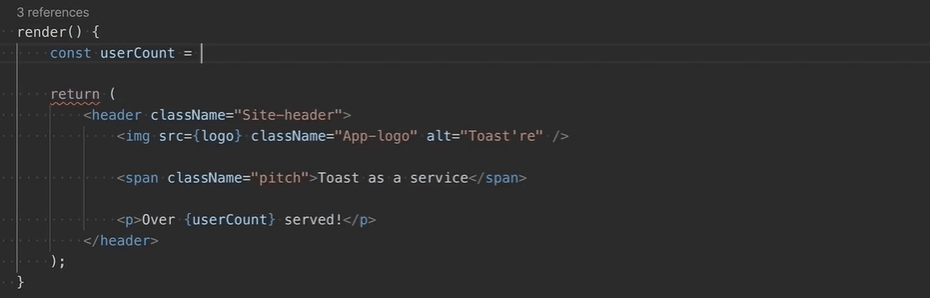


## JavaScript 项目

vscode 使用 jsconfig.json 文件定义 JavaScript 项目。常规使用不需要 jsconfig.json 文件，以下情况是必需的：

- 排除部分文件，即不作为项目文件出现在 IntelliSense 中；
- 将工作空间里的部分文件作为一个项目，在处理隐式全局依赖的遗留代码时很有用；
- 当工作空间包含多个项目时，如前端和后端代码。此时对每个项目都需要在对应根目录创建一个 `jsconfig.json` 文件；
- 使用 TypeScript 编译器向下编译 JavaScript 源码。

基本 JavaScript 项目的 `jsconfig.json` 格式：

```json
{
  "compilerOptions": {
    "module": "commonjs",
    "target": "es6"
  },
  "exclude": ["node_modules"]
}
```

> 要检查 JavaScript 文件是否属于 JavaScript 项目，只需在 vscode 中打开该文件，然后调用命令 "JavaScript: Go to Project Configuration"。如果该命令打开了 `jsconfig.json` 文件，说明该文件在项目中。


## Snippets

vscode 包含许多基本 JavaScript snippets，在编码时会自动弹出提示：

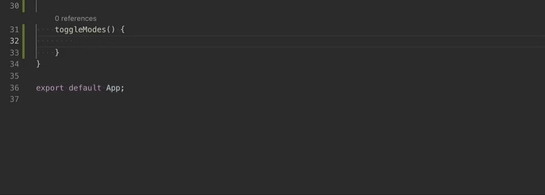

有许多扩展提供额外的 snippet，包含 Redux、Angular等流行框架的 snippets。也可以自定义 snippets。

> 在配置文件中将 `editor.snippetSuggestions` 设置为 `none` 可以禁用 snippet。还可以使用 `editor.snippetSuggestions` 设置 snippet 出现的位置：`"top"`, `"bottom"`, `"inline"`，默认为 `"inline"。`

## JSDoc 支持

vscode 支持许多标准的 JSDoc 注释，提示智能提示。在函数前输入 `/**`，然后选择弹出的 JSDoc 注释片段：

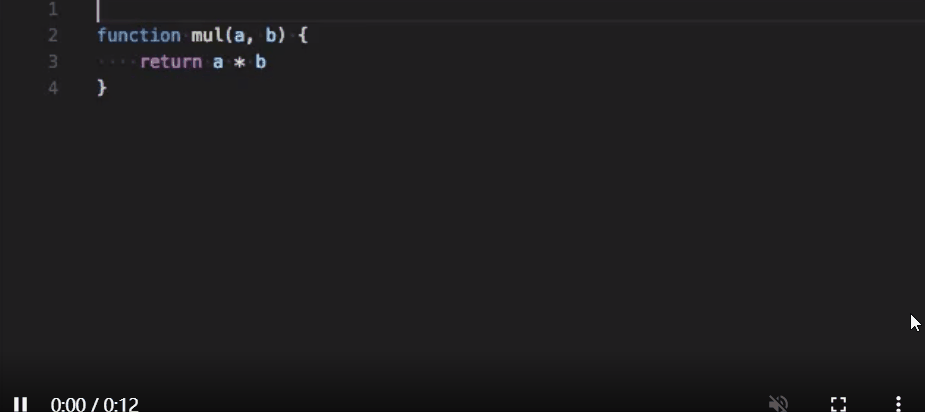

设置 `"javascript.suggest.completeJSDocs": false` 可以禁用 JSDoc 注释建议功能。

## 悬停信息

鼠标悬停在 JavaScript 符号上可以快速查看其类型和相关文档。

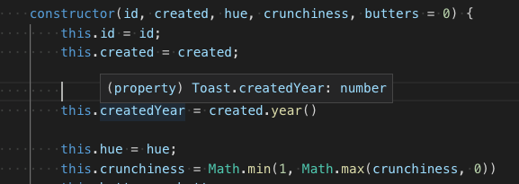

使用快捷键 `Ctrl+K Ctrl+I` 查看当前光标位置的悬停信息。

## 签名帮助

在调用 JavaScript 函数时，vscode 会弹出函数签名信息，并突出显示你正在编辑的参数：

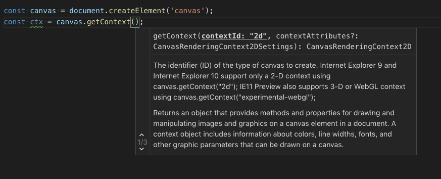

函数签名信息在输入`(`或者在函数内输入 `,` 时自动弹出。快捷键 `Ctrl+Shift+Space` 可手动触发弹出函数签名信息。

## 自动导入

vscode 根据项目中的变量及其依赖项提示可用变量，当你选择提示的变量时，vscode 会自动导入变量到文件顶部。

自动导入会显示从哪里导入：

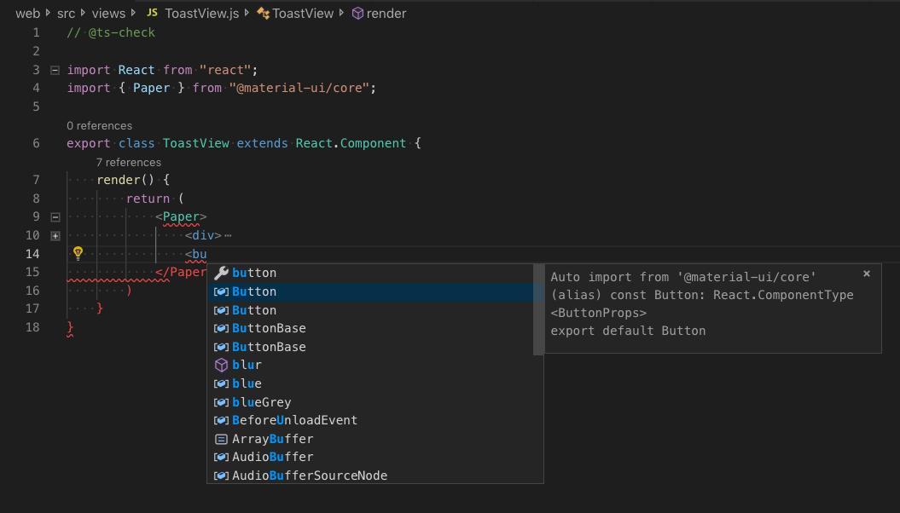

当你选择提示的变量，vscode 在文件顶部自动导入，如下：

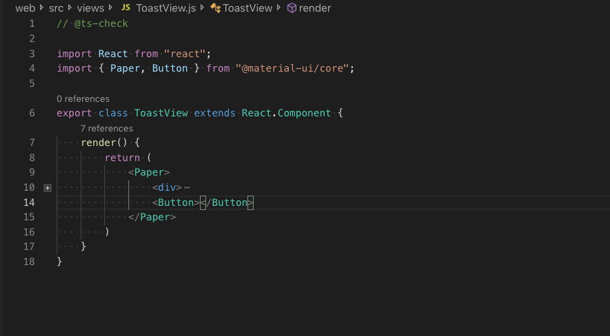

设置 `"javascript.suggest.autoImports":false` 禁用自动导入。

> vscode 会尝试推断最佳的导入样式。不过可以使用 `javascript.preferences.quoteStyle` 和 `javascript.preferences.importModuleSpecifier` 选项设置引用样式和路径样式。

## 格式化

vscode 内置有 javascript 格式化程序，提供基本的代码格式化功能。

`javascript.format.*` 选项用于设置内置格式。设置 `"javascript.format.enable":false` 可以禁用内置格式化程序。

另外，有许多扩展程序提供格式化功能。

## JSX和自动关闭标签

vscode 的所有 JavaScript 功能可以与 JSX 一起使用：

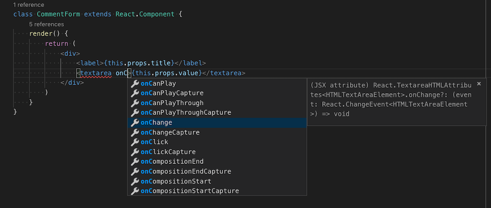

在 `*.js` 和 `*.jsx` 文件中都可以使用 JSX 语法。

vscode 包含自动关闭 JSX 标签功能：

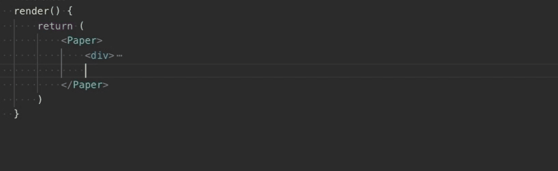

设置 `"javascript.autoClosingTags":falsle` 可以禁用该功能。


## 代码导航

代码导航是必备基础功能：

|功能|快捷键|说明|
|---|---|---|
|Go To Definition|F12|转到定义符号的源码|
|Peek Definition|Alt+F12|打开一个弹窗显示定义符号的源码|
|Go to References|Shift+F12|显示所有引用|
|Go to Type Definition||转到定义符号的类中。对于类的实例，显示类本身，而不是定义实例的位置|
|Go to Symbol in File|Ctrl+Shift+O||
|Go to Symbol in Workspace|Ctrl+T|

## 重命名

使用快捷键 `F2` 重命名光标下的符号：

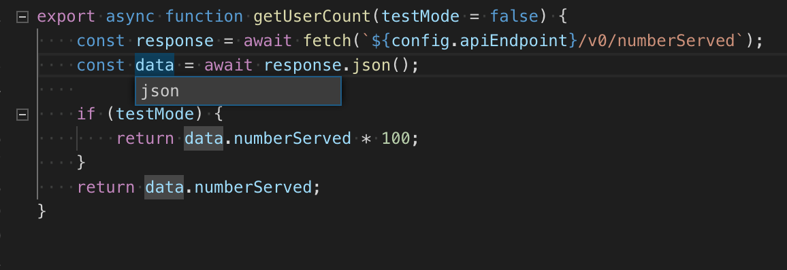

## 重构

vscode 为 JavaScript 提供了一些便捷的重构功能，例如**提取函数**和**提取常量**。

选择需要提取的代码，然后单击弹出的灯泡（或者使用 `Ctrl+.`）：

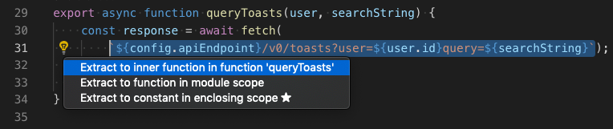

提供的重构功能有：

- 提取为函数
- 提取为常量
- 在命名导入和命名空间导入之间切换
- 移到新文件

## 未使用的变量和代码

对永远不可能运行的代码，在 vscode 中变淡显示：

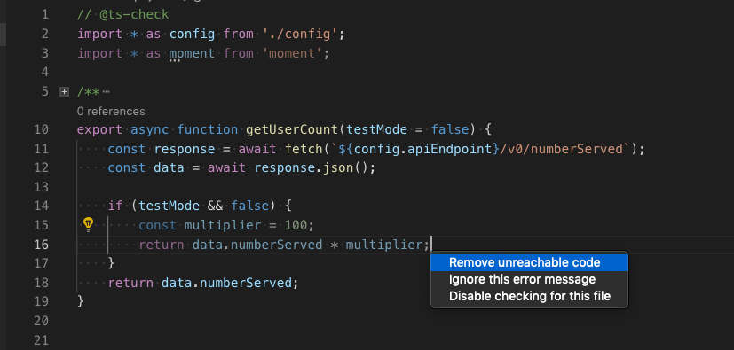

对这类代码，可以通过 `Ctrl+.` 出发快速修复选项，直接移除。

对代码淡化，可以设置 `"editor.showUnused":false` 禁用。也可以设置只在 JavaScript 中禁用：

```json
"[javascript]": {
    "editor.showUnused":  false
},
"[javascriptreact]": {
    "editor.showUnused":  false
},
```

## 组织导入

**Organize Imports** 对导入项进行排序，移除没使用的导入项：

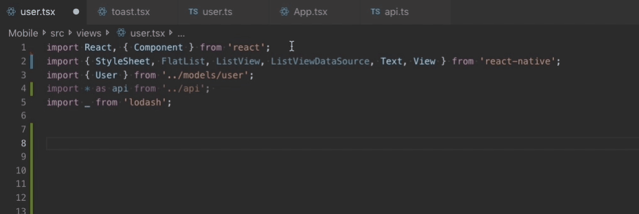

可以用过 **Source Action** 上下文菜单运行 **Organize Imports**，也可以使用快捷键 `Shift+Alt+O`。

也可以将其设置为保存文件时自动运行：

```json
"editor.codeActionsOnSave": {
    "source.organizeImports": true
}
```

## 保存选项

通过 `editor.codeActionsOnSave` 可以设置保存代码文件时自动执行的操作。例如，保存时自动整理导入项：

```json
// On save, run both fixAll and organizeImports source actions
"editor.codeActionsOnSave": {
    "source.fixAll": true,
    "source.organizeImports": true,
}
```

也可以在 `editor.codeActionsOnSave` 中包含一组按顺序执行的操作。

下面是源码操作：

- `organizeImports`，整理导入
- `fixAll`，保存时自动修复（包含 ESLint 在内的所有提供程序）。
- `"fixAll.eslint"`，自动修复 ESLint 的提示。
- `"addMissingImports"`，添加缺失的导入。

## 代码建议

vscode 会自动提供一些常见的简化代码建议，例如将 promise 一串 `.then` 调用转换为 `async` 和 `await`：

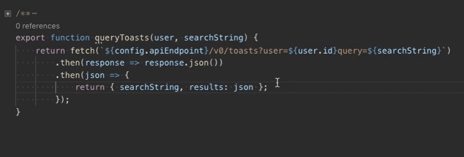

设置 `"javascript.suggestionActions.enabled":false`禁用建议。


## 参考

- https://code.visualstudio.com/docs/languages/javascript